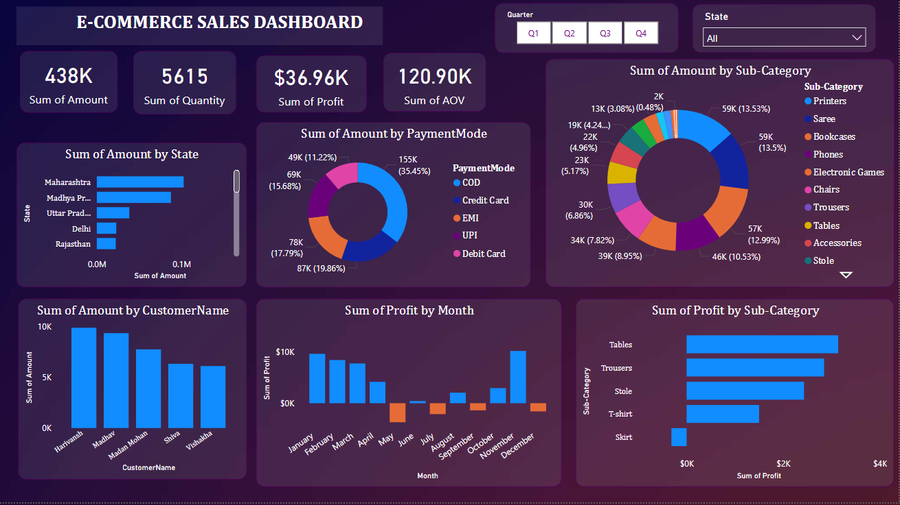

#  E-Commerce Sales Dashboard

This project presents a detailed and interactive **E-Commerce Sales Dashboard** to analyze performance across different regions, products, customers, and time periods.

---

##  Key Features

- **KPI Cards**:
  -  **Total Sales**: `438K`
  -  **Quantity Sold**: `5615`
  -  **Total Profit**: `$36.96K`
  -  **Average Order Value (AOV)**: `120.90K`

- **Interactive Filters**:
  - Quarter selection: Q1 to Q4
  - Region selection by Indian states

- **Visuals**:
  - Bar charts for:
    - Amount by Customer
    - Profit by Month
    - Profit by Sub-Category
  - Donut charts for:
    - Sales by Payment Mode
    - Sales by Sub-Category
  - State-wise Sales Breakdown

---

## 🗂 Data Sources

The dashboard uses two primary tables:

### 1. `Orders .csv`
Contains transactional-level order details:
- Order ID
- Customer Name
- State
- Sub-Category
- Quantity
- Sales
- Profit
- Order Date

### 2. `Details .csv`
Enriches orders with additional attributes:
- Payment Mode
- Possibly product or customer metadata (depending on full schema)

These tables are joined using a common key (e.g., `Order ID` or `Customer Name`) for unified analysis.

---

## 🛠 Tech Stack

- **Tool Used**: Power BI 
- **Data Format**: CSV files
- **Join Type**: Inner join or left join (based on the common key)

---

##  Insights

- **Top Region**: Maharashtra
- **Most Popular Payment Mode**: Cash on Delivery (COD)
- **Highest Revenue Sub-Categories**: Printers, Saree
- **Unprofitable Months**: June, August, October
- **High Value Customers**: Hanvanth, Madhu

---

##  Project Structure
─ Sales_report_snip.png # Dashboard screenshot
├── data/
─ Orders .csv # Primary transactional data
─ Details .csv # Supporting data (payment, metadata)
─ dashboard.pbix / .twb # Power BI 
─ README.md # Project documentation

